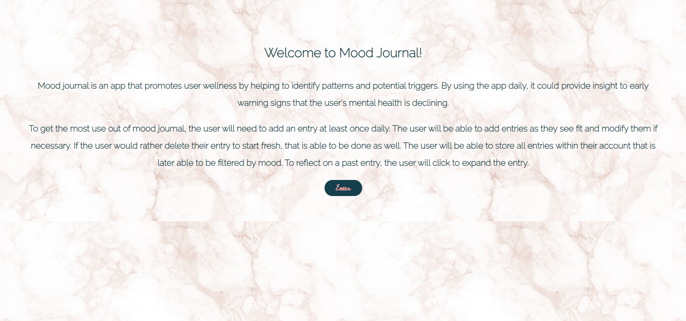

## Mood Journal
### Front End

[Live App](https://vercel.com/hjthorpe/moodjournalcapstone/411ji7036)

### What does it do?
Mood Journal allows the user to document their mood in the form of entries.  Once on the home page, the user is able add an entry and view all previous entries.  The user is also able to edit the title, content, and mood of an entry or delete an entry.  When clicking the title of an entry, the user will be redirected to a new page that contains all the entry's content.  Entries will contain a title to summarize the way that they are feeling, a mood to classify the entry, any content that the user wants to include, as well as the date the entry was created.  

### Technologies Used:
- JavaScript (React.js)
- CSS
